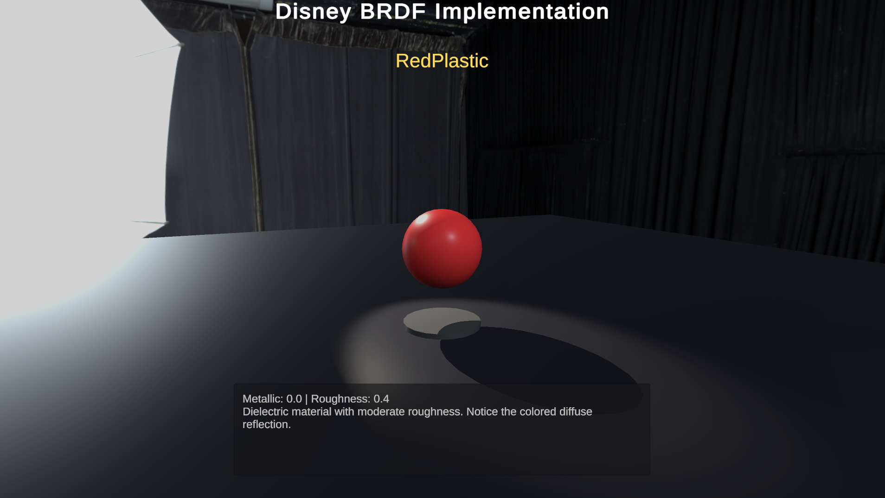
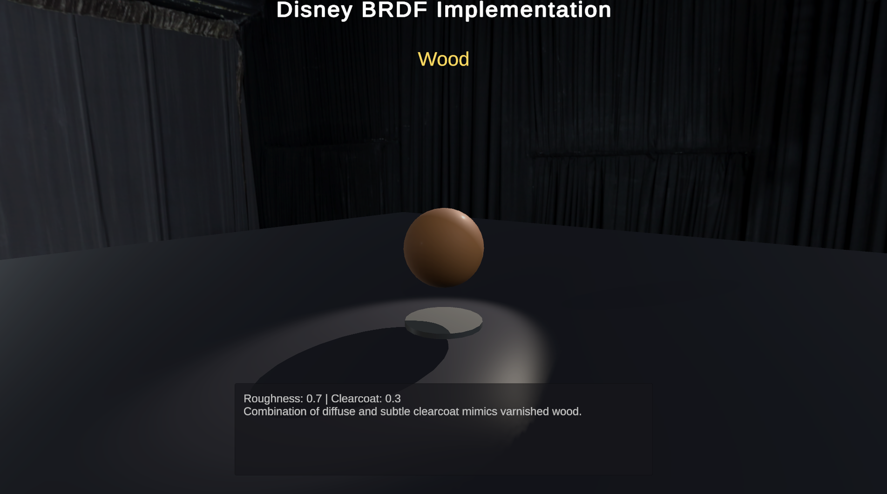

# Disney BRDF Implementation in Unity

A custom shader implementation of Disney's Principled BRDF model in Unity, featuring an interactive material showcase with real-time parameter visualization.

## About

Implemented Disney's Principled BRDF from scratch in HLSL to understand physically-based rendering at a fundamental level. The Disney BRDF, introduced by Brent Burley at SIGGRAPH 2012, is the foundation of modern PBR workflows used in Unreal Engine, Unity, and major film studios.

## Material Showcase

### Gold

Metallic: 1.0, Roughness: 0.2. Pure specular reflections with no diffuse component.

### Brushed Aluminum

Metallic: 1.0, Anisotropic: 0.8. Directional highlights simulating brushed metal surfaces.

### Red Plastic

Metallic: 0.0, Roughness: 0.4. Strong diffuse reflection with modest specular highlights.

### Velvet

Sheen: 1.0, Roughness: 0.9. Soft rim lighting at grazing angles for fabric appearance.

### Car Paint

Clearcoat: 1.0, Metallic: 0.8. Secondary specular lobe simulating clear coating over metallic base.

### Wood

Roughness: 0.7, Clearcoat: 0.3. Diffuse base with subtle clearcoat for varnished appearance.

## Technical Implementation

### BRDF Components

**Diffuse Layer**
- Modified Lambertian with Disney's retro-reflection term
- Hanrahan-Krueger subsurface scattering approximation

**Specular Layer**
- Microfacet BRDF with GGX/Trowbridge-Reitz normal distribution
- Schlick's Fresnel approximation
- Smith's geometric attenuation function
- Anisotropic variant with separate tangent/bitangent roughness

**Sheen Component**
- Grazing-angle term for fabric materials

**Clearcoat Layer**
- Secondary specular lobe with GTR distribution (γ=1)
- Fixed IOR of 1.5

### Environment Lighting

- Image-based lighting using HDRI environment maps
- Reflection probe sampling with roughness-based mip selection
- Separate indirect specular and diffuse contributions
- Energy-conserving metallic/dielectric interpolation

### Material Parameters

11 artist-friendly parameters: baseColor, metallic, roughness, subsurface, specular, specularTint, anisotropic, sheen, sheenTint, clearcoat, clearcoatGloss

### Features

- Custom Unity material editor with organized parameter groups
- Interactive demo scene with rotating pedestal
- Automatic material cycling with manual override
- Real-time UI displaying material properties
- Three-point lighting setup with HDRI environment
- WebGL build for browser compatibility

## Controls

- **Arrow Keys (← →)** or **A/D** - Switch materials
- Materials auto-cycle every 3.5 seconds

## Technical Stack

- Unity 6.0 LTS
- Custom HLSL surface shader
- Cook-Torrance microfacet model
- Image-based lighting (IBL)
- Physically-based rendering (PBR)

## References

- [Disney's Principled BRDF Paper](https://blog.selfshadow.com/publications/s2012-shading-course/burley/s2012_pbs_disney_brdf_notes_v3.pdf)
- [Real Shading in Unreal Engine 4](https://blog.selfshadow.com/publications/s2013-shading-course/karis/s2013_pbs_epic_notes_v2.pdf)

---

*All shader code written from scratch based on the original Disney BRDF paper.*